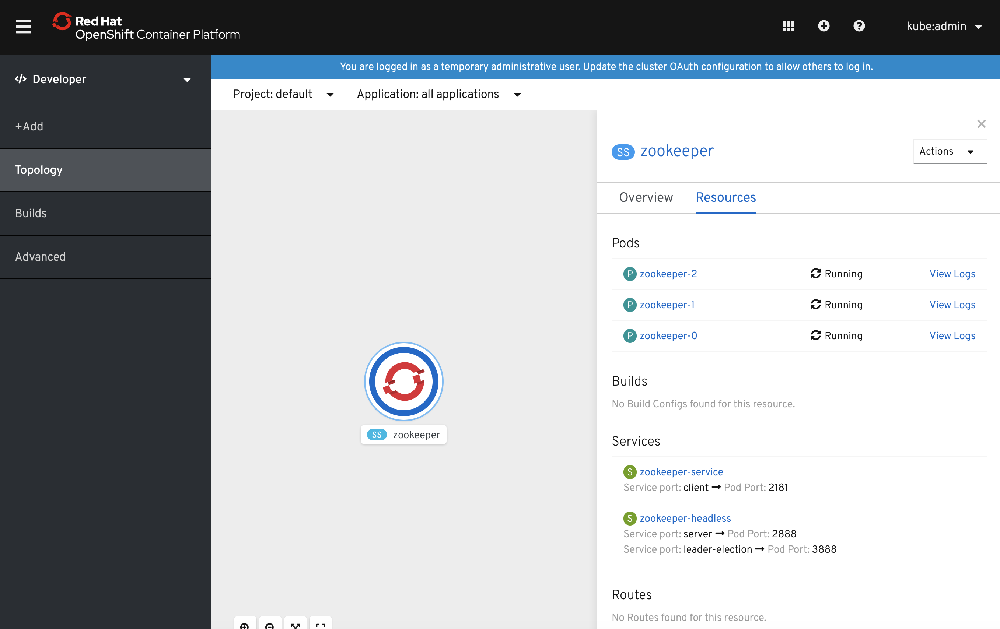

# Kubernetes StatefulSet with ZooKeeper as an example on OpenShift

## Background

This is part 2. In part 1 of this tutorial, we got an example of a ZooKeeper StatefulSet running locally with [minkube](https://kubernetes.io/docs/tasks/tools/install-minikube/).

This really builds on the last tutorial and deploys to Red Hat Open Shift local dev. Please refer to the [first tutorial](https://github.com/cloudurable/kube-zookeeper-statefulsets/wiki/Tutorial-Part-1:--Managing-Kubernetes-StatefulSets-using-ZooKeeper-and-Minikube).

As stated before, I base this tutorial from the one on the Kubernetes site on ZooKeeper and StatefulSet
but I am going to deploy to MiniKube, local Open Shift, and KIND.
I have a similar version of this Kubernetes ZooKeeper deploy working on a multi-node shared,
 corporate locked-down environment. This is a new version based on the example.
 I will simulate some of the issues that I encountered as I think there is a lot to learn.

If for some reason you would like more background on this tutorial - [background](https://github.com/cloudurable/kube-zookeeper-statefulsets/wiki/Tutorial-Part-1:--Managing-Kubernetes-StatefulSets-using-ZooKeeper-and-Minikube#background).

ZooKeeper is a nice tool to start StatefulSets with because it is small and lightweight,
yet exhibits a lot of the same needs as many disturbed, stateful, clustered applications.

> BTW, This is not my first rodeo with [ZooKeeper](https://github.com/cloudurable/zookeeper-cloud) or [Kafka](https://github.com/cloudurable/kafka-cloud) or even [deploying stateful clustered services (cassandra)](https://github.com/cloudurable/cassandra-image)
  or [managing them](https://www.linkedin.com/pulse/spark-cluster-metrics-influxdb-rick-hightower/) or setting up [KPIs](https://github.com/cloudurable/spark-cluster), but this is the first time I wrote about doing it with Kubernetes. I have also written [leadership election libs](https://github.com/advantageous/elekt) and have done [clustering](https://github.com/advantageous/qbit) with tools like ZooKeeper, namely, etcd and [Consul](https://github.com/advantageous/elekt-consul).

## Where to find the code
You can find the code for this project at:
* [Mini-Kube](https://github.com/cloudurable/kube-zookeeper-statefulsets/tree/redhat-minikube-1) - branch that got the zookeeper example running in minikube and RedHat OSE installed on my local laptop.  

## Running ZooKeeper, A Distributed System Coordinator

This tutorial shows how to use StatefulSets in local dev environments as well as
real clusters with many nodes and uses Apache Zookeeper.
This tutorial will demonstrate Kubernetes StatefulSets as well as PodDisruptionBudgets, and PodAntiAffinity.
Specifically, you will deploy to a local Open Shift instance (4.2, but 4.3 is out).

If you don't want to deploy to a Red Hat Open Shift environment, then just skip to tutorial three.


## Objectives

After this tutorial, you will know the following.

* How to deploy a ZooKeeper ensemble on Open Shift
* How to debug common issues


Later follow on tutorials might show:
* How to write deploy scripts with Kustomize to target local vs. remote deployments
* How to write deploy scripts with Helm 3 to target local vs. remote deployments
* How to create your metrics gatherers and use them with Prometheus
* How to install Kafka on top of ZooKeeper

____

## Before you begin
Before starting this tutorial, you should be familiar with the following Kubernetes concepts.

* Pods
* Cluster DNS
* Headless Services
* PersistentVolumes
* PersistentVolume Provisioning
* StatefulSets
* PodDisruptionBudgets
* PodAntiAffinity
* kubectl CLI

While the tutorial on the Kubernetes site required a cluster with at least four nodes (with 2 CPUs and 4 GiB of memory), this one will work with local Kubernetes dev environments, namely, Open Shift. The very next tutorial will show how to use [Kustomize](https://kustomize.io/) to target local dev and a real cluster. The default set up for minikube and Red Hat CodeReady Containers either dynamically provision PersistentVolumes or comes with enough out of the box to work.


____

## Recall our trouble in paradise

The zookeeper manifests that we started with would not run on minikube or local Open Shift (minishift or Red Hat CodeReady Containers) when we started. In the last tutorial, we showed how to run the ZooKeeper ensemble on minikube and how to debug issues like affinity/anti-affinity, lack of resources, etc.

The key was to change `requiredDuringSchedulingIgnoredDuringExecution` which blocks zookeeper nodes from
being deployed on the same Kubernetes worker node/host (`topologyKey: "kubernetes.io/hostname"`) to `preferredDuringSchedulingIgnoredDuringExecution`.


#### zookeeper.yaml - affinity rules preferredDuringSchedulingIgnoredDuringExecution
```yaml
apiVersion: apps/v1
kind: StatefulSet
metadata:
  name: zookeeper
spec:
  selector:
    matchLabels:
      app: zookeeper
  serviceName: zookeeper-headless
  ...
  template:
    metadata:
      labels:
        app: zookeeper
    spec:
      affinity:
        podAntiAffinity:
          preferredDuringSchedulingIgnoredDuringExecution:
            - weight: 100
              podAffinityTerm:
                labelSelector:
                  matchExpressions:
                    - key: "app"
                      operator: In
                      values:
                      - zookeeper
                topologyKey: "kubernetes.io/hostname"
```


In the next, tutorial we would like to use an overlay with Kustomize to override such config for local dev vs.
an industrial integration or prod cluster. Please check that one out too.

Let's recap what you did so far. You modified the yaml manifest for our ZooKeeper `statefulset`
to use `requiredDuringSchedulingIgnoredDuringExecution` versus `preferredDuringSchedulingIgnoredDuringExecution`.
You then noticed that you did not have enough memory for Minikube so you increased.
Along the way you did some debugging with `kubectl describe`, `kubectl get`, and `kubectl exec`.
Then you walked through the logs and compared what you know about `statefulsets` and ZooKeeper
with the output of the logs. Then you ran a bunch of commands to prove to you that the ZooKeeper ensemble was really working. You even added znode and read them. Now let's get this running on Open Shift CRC.

#### Running OpenShift Install on your Laptop with Red Hat CodeReady Containers

First, you need to install a local Open Shift.

They used to call the Open Shift for local deploys minishift which was like minikube but for Open Shift.
Now they changed it to Red Hat CodeReady Container which just rolls off the tongue. Fire that marketing guy!
Minishift is for Open Shift 3.9 but not for the latest Open Shift of 4.3.


Follow the instructions [here (Install on your Laptop with Red Hat CodeReady Containers)](https://cloud.redhat.com/openshift/install/crc/installer-provisioned),
you may have to sign up and become a Red Hat member.


You may want to delete `minikube` (`minikube delete`) or at least stop it unless you have an amazing laptop.

Once you install the open shift minishift like tool, aka CRC for short, you will want to run it.

#### Start Open Shift CRC

```sh
crc start --memory=16384


### OUTPUT
...
INFO Starting CodeReady Containers VM for OpenShift 4.2.13...
INFO Verifying validity of the cluster certificates ...
INFO Network restart not needed                   
INFO Check internal and public DNS query ...      
INFO Check DNS query from host ...                
INFO Starting OpenShift cluster ... [waiting 3m]  
...
INFO                                              
INFO You can now run 'crc console' and use these credentials to access the OpenShift web console
```

Then you want to add all of the `oc` tools to the command line. The oc tools work with Open Shift.

#### Set up the environment variables with oc-env

```sh
eval $(crc oc-env)

```

Next, you will want to make sure you switch contexts using kubecx.
If you don't know about kubectx, please see this [Kubernetes cheatsheet that I wrote](http://cloudurable.com/blog/kubernetes_k8s_kubectl_cheat_sheet/index.html).

#### Use kubectx to list Kubernetes contexts

```sh
kubectx
/api-crc-testing:6443/developer
default/api-crc-testing:6443/kube:admin
k8s-kafka
minikube
sys
```

#### Switch context with kubectx default/api-crc-testing:6443/kube:admin

```sh
kubectx default/api-crc-testing:6443/kube:admin
```
#### Log into OpenShift with oc
```sh
oc login -u kubeadmin -p cznQP-pass-pass-pass

### OUTPUT
Login successful.
You have access to 51 projects, the list has been suppressed. You can list all projects with 'oc projects'

Using project "default".
```

#### Apply zookeeper yaml file with kubectl and see by default that it fails
```sh

kubectl apply -f zookeeper.yaml

### Output
service/zookeeper-headless created
service/zookeeper-service created
poddisruptionbudget.policy/zookeeper-pdb created
statefulset.apps/zookeeper created

## See that the zookeeper-0 has an error
kubectl get pods

### OUTPUT
NAME          READY   STATUS   RESTARTS   AGE
zookeeper-0   0/1     Error    0          13s

## describe zookeeper-0 and see about the error  
kubectl describe pods zookeeper-0

### OUTPUT
Name:           zookeeper-0
Namespace:      default
Priority:       0
...
Controlled By:  StatefulSet/zookeeper
...
Events:
  Type     Reason            Age               From                         Message
  ----     ------            ----              ----                         -------
  Warning  FailedScheduling  69s               default-scheduler            pod has unbound immediate PersistentVolumeClaims
  Normal   Scheduled         69s               default-scheduler            Successfully assigned default/zookeeper-0 to crc-k4zmd-
  ...
  Normal   Pulling           5s (x4 over 62s)  kubelet, crc-k4zmd-master-0  Pulling image "cloudurable/kube-zookeeper:0.0.1"
  Normal   Pulled            2s (x4 over 59s)  kubelet, crc-k4zmd-master-0  Successfully pulled image "cloudurable/kube-zookeeper:0.0.1"
  Normal   Created           2s (x4 over 59s)  kubelet, crc-k4zmd-master-0  Created container kubernetes-zookeeper
  Normal   Started           2s (x4 over 59s)  kubelet, crc-k4zmd-master-0  Started container kubernetes-zookeeper
  Warning  BackOff           1s (x7 over 57s)  kubelet, crc-k4zmd-master-0  Back-off restarting failed container
```

Now you can see that the pod `zookeeeper-0` is failing and Kubernetes is trying to restart it but why?
Let's look at the logs and find out.

#### Use kubectl logs zookeeper-0 to see what is going on

```sh

kubectl logs zookeeper-0
#This file was autogenerated DO NOT EDIT
clientPort=2181
dataDir=/var/lib/zookeeper/data
dataLogDir=/var/lib/zookeeper/data/log
tickTime=2000
initLimit=10
syncLimit=5
maxClientCnxns=60
minSessionTimeout=4000
maxSessionTimeout=40000
autopurge.snapRetainCount=3
autopurge.purgeInteval=12
server.1=zookeeper-0.zookeeper-headless.default.svc.cluster.local:2888:3888
server.2=zookeeper-1.zookeeper-headless.default.svc.cluster.local:2888:3888
server.3=zookeeper-2.zookeeper-headless.default.svc.cluster.local:2888:3888
Creating ZooKeeper log4j configuration
mkdir: cannot create directory '/var/lib/zookeeper': Permission denied
chown: cannot access '/var/lib/zookeeper/data': Permission denied
mkdir: cannot create directory '/var/lib/zookeeper': Permission denied
chown: invalid group: 'zookeeper:USER'
/usr/bin/start.sh: line 161: /var/lib/zookeeper/data/myid: Permission denied

```

Looks like the container can't access the volume due to a permissions issue.
Recall that the `zookeeper.yaml` runs the containers with a security context

#### zookeeper.yaml - securityContext runAsUser and fsGroup
```yaml
apiVersion: apps/v1
kind: StatefulSet
metadata:
  name: zookeeper
spec:
  selector:
    matchLabels:
      app: zookeeper
  serviceName: zookeeper-headless
    ...
    spec:
      ...
      containers:
      - name: kubernetes-zookeeper
        image: "cloudurable/kube-zookeeper:0.0.1"
        ...
        volumeMounts:
        - name: datadir
          mountPath: /var/lib/zookeeper
      securityContext:
        runAsUser: 1000
        fsGroup: 1000
```

When the volumes are mounted there is an issue with permissions.
You could run our instances as root but you don't want to do that as a practice.

#### Kubernetes is a v1.16.2 while Minikube was at v1.16.0
```sh
% kubectl version
Client Version: version.Info{Major:"1", Minor:"16", GitVersion:"v1.16.2", GitCommit:"c97fe5036ef3df2967d086711e6c0c405941e14b", GitTreeState:"clean", BuildDate:"2019-10-15T23:42:50Z", GoVersion:"go1.12.10", Compiler:"gc", Platform:"darwin/amd64"}
Server Version: version.Info{Major:"1", Minor:"14+", GitVersion:"v1.14.6+a8d983c", GitCommit:"a8d983c", GitTreeState:"clean", BuildDate:"2019-12-23T12:16:26Z", GoVersion:"go1.12.12", Compiler:"gc", Platform:"linux/amd64"}
```
You ask, why are we getting a permissions error with Open Shift 4.2 and not Minikube.
I don't know, but we are.
I do know of one work around. We can use an `initContainer`.

#### zookeeper.yaml - initContainers->init-zoo
```sh
apiVersion: apps/v1
kind: StatefulSet
metadata:
  name: zookeeper
spec:
  selector:
    matchLabels:
      app: zookeeper
      ...
    spec:
      ...
      containers:
      - name: kubernetes-zookeeper
        imagePullPolicy: Always
        image: "cloudurable/kube-zookeeper:0.0.1"
        ...
        volumeMounts:
        - name: datadir
          mountPath: /var/lib/zookeeper
      securityContext:
        runAsUser: 1000
        fsGroup: 1000
      initContainers:
      - name: init-zoo
        command:

        - chown

        - -R

        - 1000:1000
        - /var/lib/zookeeper

        image: ubuntu:18.04
        imagePullPolicy: Always

        name: volume-permissions

        resources: {}

        securityContext:

          runAsUser: 0

        terminationMessagePath: /dev/termination-log

        terminationMessagePolicy: File

        volumeMounts:

        - name: datadir
          mountPath: /var/lib/zookeeper
```

Notice the `initContainer init-zoo` has a `command` that uses `chown` to change the
ownership of the  `/var/lib/zookeeper
` folder.

Now all of this works so delete and apply.

#### Recreate the zookeeper statefulset
```sh
kubectl apply -f zookeeper.yaml
kubectl delete -f zookeeper.yaml

```

#### Recreate the zookeeper statefulset
```sh
kubectl get pods
NAME          READY   STATUS    RESTARTS   AGE
zookeeper-0   1/1     Running   0          90s
zookeeper-1   1/1     Running   0          61s
zookeeper-2   1/1     Running   0          30s
```

Let's log into the OpenShift web console.

#### Start up OpenShift web console
```sh
crc console
## then login to the OpenShift web console

```


## That is all for now

We should recap this but so far we were able to create a ZooKeeper ensemble
StatefulSet on MiniKube and OpenShift with Red Hat CodeReady Containers.
