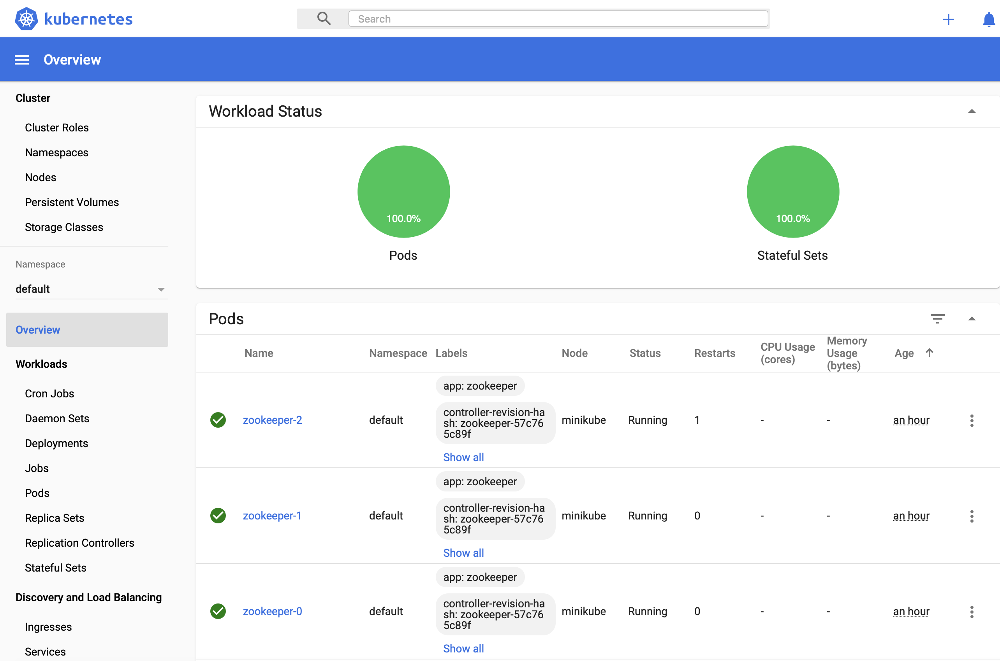
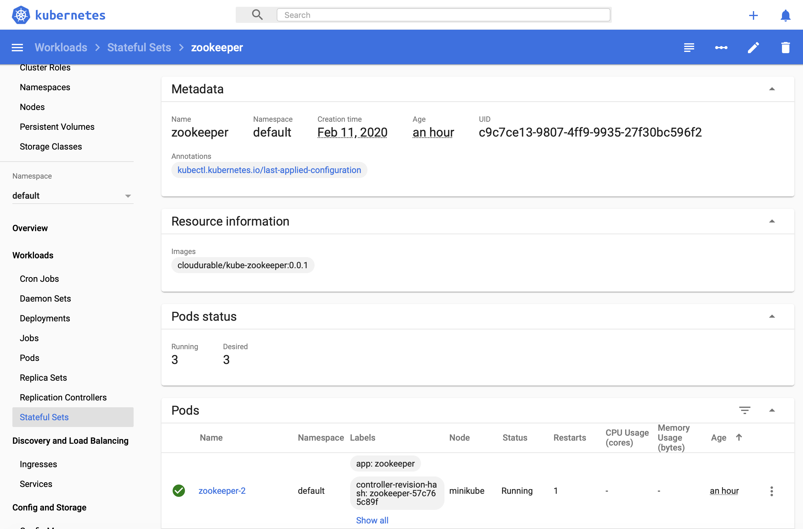

# StatefulSet with ZooKeeper as an example

## Background
I was having a really hard time deploying Kafka to Kubernetes.
It worked fine when we were doing development and integration.
We started with [Minikube](https://github.com/kubernetes/minikube) for local development.
I created a MicroSerivce that uses Kafka in Spring Boot. I ran Kafka in minikube with Helm 2.
By the way, Minikube is a mini Kubernetes that easily runs on macOS, Linux, and Windows.
Minikube is great for local application development and supports a lot of Kubernetes.
It is great for local testing.

Later we set up a pipeline and we wanted to use some of the same end to end tests
that we used for local dev in Jenkins so we decided to switch to
[Kind](https://kind.sigs.k8s.io/) for a variety of
reason. A chief reason was this was a shared Jenkins environment
(so we can't just install stuff and docker was there already) and the other reason was although
we could get minikube to run on an AWS worker instance there were too many limitations.

Kind is similar to minikube and it is also a tool for running mini Kubernetes clusters
using Docker container as nodes. It was created to test Kubernetes but it fits well
with our use cases.

One issue we had with Kind was running some of the Helm 2 install for Kafka.
After trying to debug for a good 1/2 day, we tried to switch to Helm 3, and lo
and behold, it just worked.

By the way, I wrote a [getting started with minikube](http://cloudurable.com/blog/kubernetes_k8s_osx_setup_brew/index.html)
and a [Kubernetes cheatsheet](http://cloudurable.com/blog/kubernetes_k8s_kubectl_cheat_sheet/index.html),
if you are new to minikube and kubernetes, start there. I also wrote down a lot
of tools that I use. The cheatsheet will be updated at some point to include Kind.

Let's see, we wanted to deploy to a shared environment. We tested our integration test scripts
and Kafka install on GKE, local Open Shift (tried minishift but then switch to and now Red Hat CodeReady Containers),
Minikube and KIND. Then we ran into an issue with a shared Open Shift container.
The same Helm 3 install that was working everywhere else was failing due to Pod policies
which are not changeable due to corporate Infosec policies.
Also at one point we were told we can't use Helm 3 (some corporate policy), and
we have to define our own docker containers. Now, I am not sure either of those are still
true, but we learn and adapt. This has nothing to do with Open Shift.
Now there could be a way to get the Helm 3 install to work. But since it does so much,
I found tracking down the issues and being compliant was difficult.

The lead Infra/DevOps guy in charge, told me to write my own StatefulSet, and do my own PV, PVC.
I did. I learned a lot. Debugging and troubleshooting and working around pod policies not
to mention differences in MiniKube, GKE, KIND, and Open Shift local vs. Open Shift shared corp
gave me a new perspective.

I was lucky to find this [tutorial on managing statefulsets on the Kubernetes site using ZooKeeper](https://kubernetes.io/docs/tutorials/stateful-application/zookeeper/). The scripts as written did not work without change in any environment
where I ran it except maybe GKE. But trial and error and troubleshooting is a good way to learn.

I base this tutorial from the one on the Kubernetes site on ZooKeeper and StatefulSet
but I am going to deploy to MiniKube, local Open Shift, and KIND.
I have a similar version of this Kubernetes ZooKeeper deploy working on a multi-node shared,
 corporate locked down environment. This is a new version based on the example.
 I will simulate some of the issues that I encountered as I think there is a lot to learn.

ZooKeeper is a nice tool to start StatefulSets with because it is small and lightweight,
yet exhibits a lot of the same needs as many disturbed, stateful, clustered applications.

> BTW, This is not my first rodeo with [ZooKeeper](https://github.com/cloudurable/zookeeper-cloud) or [Kafka](https://github.com/cloudurable/kafka-cloud) or even [deploying stateful clustered services (cassandra)](https://github.com/cloudurable/cassandra-image)
  or [managing them](https://www.linkedin.com/pulse/spark-cluster-metrics-influxdb-rick-hightower/) or setting up [KPIs](https://github.com/cloudurable/spark-cluster), but this is the first time I wrote about doing it with Kubernetes. I have also written [leadership election libs](https://github.com/advantageous/elekt) and have done [clustering](https://github.com/advantageous/qbit) with tools like ZooKeeper, namely, etcd and [Consul](https://github.com/advantageous/elekt-consul).


## Running ZooKeeper, A Distributed System Coordinator

This tutorial shows how to use StatefulSets in local dev environments as well as
real clusters with many nodes and uses Apache Zookeeper.
This tutorial will demonstrate Kubernetes StatefulSets as well as PodDisruptionBudgets, and PodAntiAffinity.

It should augment [Running ZooKeeper, A Distributed System Coordinator](https://kubernetes.io/docs/tutorials/stateful-application/zookeeper/) but adds more details in debugging and more details regarding StatefulSets, Volumes, and PodAntiAffinity.

This will be a standalone tutorial. You don't have to read the other one but I recommend it.
If you are using MiniKube or MiniShift or Kind to learn Kubernetes, then this tutorial should work unlike the other.


## Objectives

After this tutorial, you will know the following.

* How to deploy a ZooKeeper ensemble using StatefulSet
* How to deploy ZooKeeper servers on multiple nodes for availability
* How to use PodDisruptionBudgets ensuring availability
* How to use PodAntiAffinity to deploy to a local environment
* How to use PodAntiAffinity to deploy to a production or integration environment
* How to create your own Docker container that uses ZooKeeper
* How to create your own liveness probes and ready probes
* How to test that your ZooKeeper install really worked
* How to debug common issues


Later follow on tutorials might show:
* How to write deploy scripts with Kustomize to target local vs. remote deployments
* How to write deploy scripts with Helm 3 to target local vs. remote deployments
* How to create your metrics gatherers and use them with Prometheus
* How to install Kafka on top of ZooKeeper
* How to install Istio with ZooKeeper to get dashboards
* How to install Istio with ZooKeeper to get mTLS  
* How to write a Spring Boot app that uses Kafka, and Istio

____

## Before you begin
Before starting this tutorial, you should be familiar with the following Kubernetes concepts.

* Pods
* Cluster DNS
* Headless Services
* PersistentVolumes
* PersistentVolume Provisioning
* StatefulSets
* PodDisruptionBudgets
* PodAntiAffinity
* kubectl CLI

While the other tutorial required a cluster with at least four nodes (with 2 CPUs and 4 GiB of memory), this one will work with local Kubernetes dev environments. A later tutorial will show how to use [Kustomize](https://kustomize.io/) to target local dev and a real cluster. The default set up for minikube and Red Hat CodeReady Containers either dynamically provision PersistentVolumes or comes with enough out of the box to work.


## ZooKeeper Basics
[ZooKeeper](https://zookeeper.apache.org/) is a distributed config system that uses a consensus algorithm. ZooKeeper is similar to
Consul or etcd if you are familiar with them. It gets used by Kafka and Hadoop and quite a few others. Personally, I prefer Consul
and etcd. But since a lot of projects use it, it is very common.

ZooKeeper allows you perform CRUD operations on config and watch for updates to the config. The config can be the state of your cluster (which nodes are up or down who is the leader). Think of it like a consistent view of config data ordered in a file system like hierarchy. The major difference between a regular file system to store config is that a ZooKeeper cluster forms an ensemble so that all of the data is in-sync using a consensus algorithm. If you are familiar with these concepts from Consul, etcd or even Spark or Cassandra or MongoDB then you have a basic understanding of ZooKeeper too.


While Consul and etcd use [RAFT](https://raft.github.io/) as a consensus algorithm, ZooKeeper ensures uses the Zab consensus protocol to replicate data in a consistent state across all members of the ensemble. Both [Zab](https://cwiki.apache.org/confluence/display/ZOOKEEPER/Zab+vs.+Paxos) and RAFT are faster, lighter than [Paxos](https://en.wikipedia.org/wiki/Paxos_(computer_science) which you may have studied in school but have similar concepts.

ZooKeeper uses Zab protocol to elect a leader. The ZooKeeper ensemble can't write data unless there is a leader. This keeps the data
very consistent. The ZooKeeper ensemble replicates all writes to a quorum defined by Zab protocol before the data becomes visible to clients. As stated if you are familiar with quorums from Cassandra, MongoDB, etcd or Consul, it is really more of the same ideas behind quorums. A quorum is a majority of ZooKeeper nodes in the ensemble and the leader. "For instance, if the ensemble has three servers, a component that contains the leader and one other server constitutes a quorum. If the ensemble can not achieve a quorum, the ensemble cannot write data." --[https://kubernetes.io/docs/tutorials/stateful-application/zookeeper/#zookeeper-basics](https://kubernetes.io/docs/tutorials/stateful-application/zookeeper/#zookeeper-basics)

ZooKeeper servers store config in memory. The config memory is periodically written to disk.
Also every change to a ZooKeeper instance get written to a a Write Ahead Log (WAL) which is on disk.  
ZooKeeper nodes that crash or are updated, recover by reading the last snapshot and then replaying the WAL.
After a snapshot the WALs are deleted. This prevents the disk from filling up. --[https://kubernetes.io/docs/tutorials/stateful-application/zookeeper/#zookeeper-basics](https://kubernetes.io/docs/tutorials/stateful-application/zookeeper/#zookeeper-basics)

____

## Set up Kubernetes / Minikube

This tutorial does not assume you even have Kubernetes set up at all.
If you are using a [OSX machine use this tutorial to set up minikube](http://cloudurable.com/blog/kubernetes_k8s_osx_setup_brew/index.html). If you are not using OSX then first [install minikube](https://kubernetes.io/docs/tasks/tools/install-minikube/) and then go through that tutorial and this [Kubernetes cheatsheet](http://cloudurable.com/blog/kubernetes_k8s_kubectl_cheat_sheet/index.html).

Once you feel comfortable with minikube, delete the cluster and create it again with this command.

#### Minikube
```sh
minikube start --kubernetes-version v1.16.0 \
              --vm-driver=hyperkit \
              --cpus=4 \
              --disk-size='100000mb' \
              --memory='6000mb'
```

We choose kubernetes version 1.16.0, using hyperkit with 4 CPUs, 10GB of disk and 6 GB of memory for the whole cluster.

You should add some extra memory too and a bit extra disk space. This should all run on a modern laptop with at least 16GB of ram.


___

## Creating a ZooKeeper Ensemble

Just like the other example this one has a manifest that contains a Headless Service, a Service, a PodDisruptionBudget, and a StatefulSet. --[Creating a ZooKeeper Ensemble](https://kubernetes.io/docs/tutorials/stateful-application/zookeeper/#creating-a-zookeeper-ensemble)

#### zookeeper.yaml Kubernetes Objects: Headless Service, a Service, a PodDisruptionBudget, and a StatefulSet
```yaml
apiVersion: v1
kind: Service
metadata:
  name: zookeeper-headless
  labels:
    app: zookeeper
spec:
  ports:
  - port: 2888
    name: server
  - port: 3888
    name: leader-election
  clusterIP: None
  selector:
    app: zookeeper
---
apiVersion: v1
kind: Service
metadata:
  name: zookeeper-service
  labels:
    app: zookeeper
spec:
  ports:
  - port: 2181
    name: client
  selector:
    app: zookeeper
---
apiVersion: policy/v1beta1
kind: PodDisruptionBudget
metadata:
  name: zookeeper-pdb
spec:
  selector:
    matchLabels:
      app: zookeeper
  maxUnavailable: 1
---
apiVersion: apps/v1
kind: StatefulSet
metadata:
  name: zookeeper
spec:
  selector:
    matchLabels:
      app: zookeeper
  serviceName: zookeeper-headless
  replicas: 3
  updateStrategy:
    type: RollingUpdate
  podManagementPolicy: OrderedReady
  template:
    metadata:
      labels:
        app: zookeeper
    spec:
      affinity:
        podAntiAffinity:
          requiredDuringSchedulingIgnoredDuringExecution:
            - labelSelector:
                matchExpressions:
                  - key: "app"
                    operator: In
                    values:
                    - zookeeper
              topologyKey: "kubernetes.io/hostname"
      containers:
      - name: kubernetes-zookeeper
        imagePullPolicy: Always
        image: "cloudurable/kube-zookeeper:0.0.1"
        resources:
          requests:
            memory: "1Gi"
            cpu: "0.5"
        ports:
        - containerPort: 2181
          name: client
        - containerPort: 2888
          name: server
        - containerPort: 3888
          name: leader-election
        command:
        - sh
        - -c
        - "start.sh \
          --servers=3 \
          --data_dir=/var/lib/zookeeper/data \
          --data_log_dir=/var/lib/zookeeper/data/log \
          --conf_dir=/opt/zookeeper/conf \
          --client_port=2181 \
          --election_port=3888 \
          --server_port=2888 \
          --tick_time=2000 \
          --init_limit=10 \
          --sync_limit=5 \
          --heap=512M \
          --max_client_cnxns=60 \
          --snap_retain_count=3 \
          --purge_interval=12 \
          --max_session_timeout=40000 \
          --min_session_timeout=4000 \
          --log_level=INFO"
        readinessProbe:
          exec:
            command:
            - sh
            - -c
            - "ready_live.sh 2181"
          initialDelaySeconds: 10
          timeoutSeconds: 5
        livenessProbe:
          exec:
            command:
            - sh
            - -c
            - "ready_live.sh 2181"
          initialDelaySeconds: 10
          timeoutSeconds: 5
        volumeMounts:
        - name: datadir
          mountPath: /var/lib/zookeeper
      securityContext:
        runAsUser: 1000
        fsGroup: 1000
  volumeClaimTemplates:
  - metadata:
      name: datadir
    spec:
      accessModes: [ "ReadWriteOnce" ]
      resources:
        requests:
          storage: 10Gi

```

The above is almost the exact same as the one in the other tutorial except I changed the name
of the scripts, the docker image and made the names longer so they would be easier to read.
In other words, it won't work on minikube or local Open Shift (minishift or Red Hat CodeReady Containers),
but how it does't work is a teachable moment.

### Create the statefulset no edits

From the command line, use `kubectl apply` to create the StatefulSet, services, etc.

#### Create Headless Service, a Service, a PodDisruptionBudget, and a StatefulSet
```sh
kubectl apply -f zookeeper.yaml

#### OUTPUT
service/zookeeper-headless created
service/zookeeper-service created
poddisruptionbudget.policy/zookeeper-pdb created
statefulset.apps/zookeeper created
```

Next let's check to see if the pods for the ZooKeeper StatefulSet were created.

#### Check status of pods in statefulset
```sh
kubectl get pods

### Output
NAME          READY   STATUS    RESTARTS   AGE
zookeeper-0   1/1     Running   0          63s
zookeeper-1   0/1     Pending   0          47s
```

Wow. That is taking a long time. Well, go check to see if you got any texts on your phone and come back, then check again.

#### Check status of pods in statefulset again
```sh
kubectl get pods

### Output
NAME          READY   STATUS    RESTARTS   AGE
zookeeper-0   1/1     Running   0          70s
zookeeper-1   0/1     Pending   0          54s
```

Wow. That is taking a long time. Well, go check to see if you got any emails and come back, then check again.

#### Check status of pods in statefulset for the third time.  
```sh
% kubectl get pods


NAME          READY   STATUS    RESTARTS   AGE
zookeeper-0   1/1     Running   0          5m24s
zookeeper-1   0/1     Pending   0          5m8s
(⎈ |minikube:default)richardhightower@Richards-MacBook-Pro kube-zookeeper-statefulsets %
```

It has been five minutes and the 2nd ZooKeeper node is just not getting created.
Let's see why. We need a total of three ZooKeeper nodes to create an ensemble.

### Debug why the statefulset did not work

We can use the `kubectl describe` command to see the events for the `zookeeper-1` pod.

```sh
kubectl describe pod zookeeper-1


### OUTPUT
Name:           zookeeper-1
Namespace:      default
Priority:       0
Node:           <none>
Labels:         app=zookeeper
                controller-revision-hash=zookeeper-7b7f6f8cb9
                statefulset.kubernetes.io/pod-name=zookeeper-1
...
Events:
  Type     Reason            Age        From               Message
  ----     ------            ----       ----               -------
  Warning  FailedScheduling  <unknown>  default-scheduler  pod has unbound immediate PersistentVolumeClaims
  Warning  FailedScheduling  <unknown>  default-scheduler  pod has unbound immediate PersistentVolumeClaims
  Warning  FailedScheduling  <unknown>  default-scheduler  0/1 nodes are available: 1 node(s) didn't match pod affinity/anti-affinity, 1 node(s) didn't satisfy existing pods anti-affinity rules.                
```

Ok, we can see that we did not actually schedule this pod to run on any node because we only have one node.
The message `0/1 nodes are available: 1 node(s) didn't match pod affinity/anti-affinity, 1 node(s) didn't satisfy existing pods anti-affinity rules`. Let's take a look at the affinity rule from our yaml file.

#### zookeeper.yaml - affinity rules requiredDuringSchedulingIgnoredDuringExecution
```yaml
...
apiVersion: apps/v1
kind: StatefulSet
metadata:
  name: zookeeper
spec:
  ...
  template:
    metadata:
      labels:
        app: zookeeper
    spec:
      affinity:
        podAntiAffinity:
          requiredDuringSchedulingIgnoredDuringExecution:
            - labelSelector:
                matchExpressions:
                  - key: "app"
                    operator: In
                    values:
                    - zookeeper
              topologyKey: "kubernetes.io/hostname"
```

The key here is that we set a rule via `requiredDuringSchedulingIgnoredDuringExecution` which blocks zookeeper nodes from
being deployed on the same Kubernetes worker node/host (`topologyKey: "kubernetes.io/hostname"`).

As I stated earlier, in later tutorials we would like to use an overlay with Kustomize to override such config for local dev vs.
an industrial integration or prod cluster. But as a workaround, let's turn the `affinity/podAntiAffinity` rule into more of
a suggestion with `preferredDuringSchedulingIgnoredDuringExecution`. While you will likely want `requiredDuringSchedulingIgnoredDuringExecution` for production, you may get away with `preferredDuringSchedulingIgnoredDuringExecution`
for development. What this statements do is really spelled out well in their name, but if you want to dive deeper, I suggest
[Assigning Pods to Nodes](https://kubernetes.io/docs/concepts/configuration/assign-pod-node/).


#### zookeeper.yaml - affinity rules preferredDuringSchedulingIgnoredDuringExecution
```yaml
apiVersion: apps/v1
kind: StatefulSet
metadata:
  name: zookeeper
spec:
  selector:
    matchLabels:
      app: zookeeper
  serviceName: zookeeper-headless
  ...
  template:
    metadata:
      labels:
        app: zookeeper
    spec:
      affinity:
        podAntiAffinity:
          preferredDuringSchedulingIgnoredDuringExecution:
            - weight: 100
              podAffinityTerm:
                labelSelector:
                  matchExpressions:
                    - key: "app"
                      operator: In
                      values:
                      - zookeeper
                topologyKey: "kubernetes.io/hostname"
```

Ok. You will need to change to `preferredDuringSchedulingIgnoredDuringExecution` and
remove `requiredDuringSchedulingIgnoredDuringExecution` (edit `zookeeper.yaml`).
Then you need to delete the Kubernetes objects from the cluster using the yaml file
for the `statefulset` and then recreate Kubernetes objects for `the statefulset`.

From the command line, delete the `statefulset` objects.

#### Delete `statefulset` objects using zookeeper.yaml.

```sh
kubectl delete -f zookeeper.yaml

### OUTPUT
service "zookeeper-headless" deleted
service "zookeeper-service" deleted
poddisruptionbudget.policy "zookeeper-pdb" deleted
statefulset.apps "zookeeper" deleted

```

Just to get a clean slate, go ahead and delete the persistent volume claims too.
This is not required at all.

#### Delete persistent volume claims
```sh
kubectl delete pvc datadir-zookeeper-0
kubectl delete pvc datadir-zookeeper-1

### Output
persistentvolumeclaim "datadir-zookeeper-0" deleted
persistentvolumeclaim "datadir-zookeeper-1" deleted

```

Now you have a pristine Kubernetes local dev cluster, let's create the `statefulsets`
objects again.

#### Create StatefulSet for ZooKeeper again with preferredDuringSchedulingIgnoredDuringExecution
```sh
kubectl apply -f zookeeper.yaml   

### Output    
service/zookeeper-headless created
service/zookeeper-service created
poddisruptionbudget.policy/zookeeper-pdb created
statefulset.apps/zookeeper created

```

As before, let's check the status of ZooKeeper pod creations. This time you can use the -w flag to watch the
pod creation status change as it happens.

#### Use kubectl get pods to see ZooKeeper pod creations status
```sh
% kubectl get pods -w     

### OUTPUT        
NAME          READY   STATUS              RESTARTS   AGE
zookeeper-0   0/1     ContainerCreating   0          10s
zookeeper-0   0/1     Running             0          39s
zookeeper-0   1/1     Running             0          54s
zookeeper-1   0/1     Pending             0          1s
zookeeper-1   0/1     Pending             0          1s
zookeeper-1   0/1     Pending             0          2s
zookeeper-1   0/1     ContainerCreating   0          2s
zookeeper-1   0/1     Running             0          5s
zookeeper-1   1/1     Running             0          17s
zookeeper-2   0/1     Pending             0          0s
zookeeper-2   0/1     Pending             0          0s
zookeeper-1   0/1     Running             0          67s
zookeeper-1   1/1     Running             0          87s

...

kubectl get pods   

### OUTPUT
NAME          READY   STATUS    RESTARTS   AGE
zookeeper-0   1/1     Running   0          4m41s
zookeeper-1   1/1     Running   0          3m47s
zookeeper-2   0/1     Pending   0          3m30s


```

It got stuck again. I wonder why.
Well it looks like `zookeeper-1` was created so our `preferredDuringSchedulingIgnoredDuringExecution`
worked well. But, `zookeeper-2`, never runs. Let's use `kubectl describe` to see why

#### Checking status of zookeeper-2 node with kubectl describe

```sh

kubectl describe pod zookeeper-2

### OUTPUT
...
Node-Selectors:  <none>
Tolerations:     node.kubernetes.io/not-ready:NoExecute for 300s
                 node.kubernetes.io/unreachable:NoExecute for 300s
Events:
  Type     Reason            Age        From               Message
  ----     ------            ----       ----               -------
  Warning  FailedScheduling  <unknown>  default-scheduler  0/1 nodes are available: 1 Insufficient memory.
  Warning  FailedScheduling  <unknown>  default-scheduler  0/1 nodes are available: 1 Insufficient memory.
```

You can see that there was `Insufficient memory` and thus `zookeeper-2` `FailedScheduling`.

Clearly you can see that `kubectl describe` is a powerful tool to see errors.

You can even use `kubectl describe` with the `statefulset` object itself.
This means that you will have to recreate minikube with more memory.


#### Checking status of zookeeper statefulsets with kubectl describe and get
```sh
kubectl describe statefulsets zookeeper

### OUTPUT
Name:               zookeeper
Namespace:          default
CreationTimestamp:  Tue, 11 Feb 2020 12:50:52 -0800
Selector:           app=zookeeper
...
Replicas:           3 desired | 3 total
Pods Status:        2 Running / 1 Waiting / 0 Succeeded / 0 Failed
...
Events:
  Type    Reason            Age   From                    Message
  ----    ------            ----  ----                    -------
  Normal  SuccessfulCreate  12m   statefulset-controller  create Claim datadir-zookeeper-0 Pod zookeeper-0 in StatefulSet zookeeper success
  Normal  SuccessfulCreate  12m   statefulset-controller  create Pod zookeeper-0 in StatefulSet zookeeper successful
  Normal  SuccessfulCreate  11m   statefulset-controller  create Claim datadir-zookeeper-1 Pod zookeeper-1 in StatefulSet zookeeper success
  Normal  SuccessfulCreate  11m   statefulset-controller  create Pod zookeeper-1 in StatefulSet zookeeper successful
  Normal  SuccessfulCreate  10m   statefulset-controller  create Claim datadir-zookeeper-2 Pod zookeeper-2 in StatefulSet zookeeper success
  Normal  SuccessfulCreate  10m   statefulset-controller  create Pod zookeeper-2 in StatefulSet zookeeper successful

...

kubectl get  statefulsets zookeeper

### OUTPUT
NAME        READY   AGE
zookeeper   2/3     17m

```

You can see that it created all of the pods like it suppose to but it is forever waiting on the last pod by looking
at `Pods Status:        2 Running / 1 Waiting / 0 Succeeded / 0 Failed`.
Also doing a `kubectl get  statefulsets zookeeper`
shows that only 2 of the 3 pods is ready as well (`zookeeper   2/3     17m`).

Since the `statefulset` wouldn't fit into memory on you local dev environment,
let's recreate minikube with more memory. You will delete minikube and then create it again.

```sh
minikube delete

minikube start  --kubernetes-version v1.16.0 \
                --vm-driver=hyperkit \
                --cpus=4 \
                --disk-size='100000mb' \
                --memory='7500mb'

### OUTPUT
🔥  Deleting "minikube" in hyperkit ...
💔  The "minikube" cluster has been deleted.
...
😄  minikube v1.4.0 on Darwin 10.15.1
🔥  Creating hyperkit VM (CPUs=4, Memory=7500MB, Disk=100000MB) ...
🐳  Preparing Kubernetes v1.16.0 on Docker 18.09.9 ...
🚜  Pulling images ...
🚀  Launching Kubernetes ...
⌛  Waiting for: apiserver proxy etcd scheduler controller dns
🏄  Done! kubectl is now configured to use "minikube"                
```
It fit two ZooKeeper nodes/container/pods into 6GB so figured that kube control plane took up some space and you just need another 1.5GB for our 3rd Zookeeper node.
It was a swag. Less memory for `minikube` means more memory for your other development tools (IDE, etc.).

> By the way, this eats up a lot of memory for just a local dev environment so later in another tutorial,
 we will run ZooKeeper in a single node mode. I have done this before either [here at ZooKeeper cloud](https://github.com/cloudurable/zookeeper-cloud/tree/master/zookeeper-image) or [here at Kafka cloud](https://github.com/cloudurable/kafka-cloud/tree/master/kafka-image). This will allow us to create a single pod cluster for local dev which will save a lot of memory on our dev laptop.


Now let's create the ZooKeeper `statefulset` and check its status.


#### Create ZooKeeper `statefulset` and check satus with kubectl get pods -w
```sh
kubectl apply -f zookeeper.yaml   

### OUTPUT
service/zookeeper-headless created
service/zookeeper-service created
poddisruptionbudget.policy/zookeeper-pdb created
statefulset.apps/zookeeper created


kubectl get pods -w     


### OUTPUT
NAME          READY   STATUS              RESTARTS   AGE
zookeeper-0   0/1     ContainerCreating   0          13s
zookeeper-0   0/1     Running             0          46s
zookeeper-0   1/1     Running             0          62s
zookeeper-1   0/1     Pending             0          0s
zookeeper-1   0/1     Pending             0          0s
zookeeper-1   0/1     Pending             0          1s
zookeeper-1   0/1     ContainerCreating   0          1s
zookeeper-1   0/1     Running             0          4s
zookeeper-1   1/1     Running             0          20s
zookeeper-2   0/1     Pending             0          0s
zookeeper-2   0/1     Pending             0          0s
zookeeper-2   0/1     Pending             0          1s
zookeeper-2   0/1     ContainerCreating   0          1s
zookeeper-2   0/1     Running             0          5s
zookeeper-2   1/1     Running             0          14s
```

Now let's check the status of our ZooKeeper statefulset and the pods again.

#### Check status of ZooKeeper statefulset and its pods
```sh
kubectl get pods                  

### OUTPUT
NAME          READY   STATUS    RESTARTS   AGE
zookeeper-0   1/1     Running   1          25m
zookeeper-1   1/1     Running   0          24m
zookeeper-2   1/1     Running   0          24m

kubectl get statefulsets
### OUTPUT

NAME        READY   AGE
zookeeper   3/3     26m

```

All three are up and you can see that I got a phone call between creation and status check.

Now let's look around a bit.


#### See the Persistent Volumes
```sh
kubectl get pv

### OUTPUT
NAME                CAPACITY   ACCESS MODES   RECLAIM POLICY   STATUS   CLAIM                         STORAGECLASS   REASON   AGE
pvc-20e452bf-fe67   10Gi       RWO            Delete           Bound    default/datadir-zookeeper-1   standard                26m
pvc-4e59068b-8170   10Gi       RWO            Delete           Bound    default/datadir-zookeeper-0   standard                27m
pvc-e8a57062-64b9   10Gi       RWO            Delete           Bound    default/datadir-zookeeper-2   standard                26m
```
#### See the Persistent Volumes Claims
```sh
kubectl get pvc

### OUTPUT
NAME                  STATUS   VOLUME              CAPACITY   ACCESS MODES   STORAGECLASS   AGE
datadir-zookeeper-0   Bound    pvc-4e59068b-8170   10Gi       RWO            standard       28m
datadir-zookeeper-1   Bound    pvc-20e452bf-fe67   10Gi       RWO            standard       27m
datadir-zookeeper-2   Bound    pvc-e8a57062-64b9   10Gi       RWO            standard       26m
(⎈ |minikube:default)richardhightower@Richards-MacBook-Pro kube-zookeeper-statefulsets

```

You can see that each instance claims a volume and you can also see that Minikube creates the volumes on the fly.
It will be interesting to look at the default behavior of OpenShift later.

How can we trust that this all works? You can look at logs for errors. You can connect to the kubernetes console and see if we see get see errors. I mean so far it looks like it is working! Yeah!

Let's connect to an instance and see if you can run some commands. You will use network cat ([nc](https://en.wikipedia.org/wiki/Netcat))
to send  ***ZooKeeper Commands*** also known as "The Four Letter Words" to ZooKeeper port 2181 which was configured for
the `zookeeper-service`'s `client` port service (see
[ZooKeeper](https://zookeeper.apache.org/doc/r3.4.14/zookeeperAdmin.html) admin guide for more details on ZooKeeper Commands).

The command `kubectl  exec -it zookeeper-0` will run a command on a pod. The `-it` options allows us to have an interactive
terminal so you will run bash and poke around with some ZooKeeper commands.


### Connecting to ZooKeeper instance to and see if it is working (if you need to debug later)
```sh
kubectl  exec -it zookeeper-0 bash

## Check to see if the node is ok send ruok to port 2181 with network cat.
$ echo "Are you ok? $(echo ruok | nc 127.0.0.1 2181)"
iamok

## Use the srvr to see if this node is the leader.
$ echo srvr | nc localhost 2181 | grep Mode
Mode: follower

$ exit

## Let's try to find the leader of the ZooKeeper ensemble

kubectl  exec -it zookeeper-1 bash
$ echo srvr | nc localhost 2181 | grep Mode
Mode: leader

$ exit

kubectl  exec -it zookeeper-2 bash
$ echo srvr | nc localhost 2181 | grep Mode
Mode: follower

```

Please note that `zookeeper-1` is the ZooKeeper ensemble leader.

The ZooKeeper command `dump` lists the outstanding sessions and ephemeral nodes but you have run this from the leader.
This only works on the leader.
Your master is the one that returned `Mode: leader` from `echo srvr | nc localhost 2181 | grep Mode`.

#### Run the dump command on the master and other .
```sh
kubectl  exec -it zookeeper-1 bash


## Show the dump command
$ echo dump | nc localhost 2181
SessionTracker dump:
Session Sets (0):
ephemeral nodes dump:
Sessions with Ephemerals (0):


## Get stats
$ echo stat | nc localhost 2181
Zookeeper version: 3.4.14-4c25d480e66aadd371de8bd2fd8da255ac140bcf, built on 03/06/2019 16:18 GMT
Clients:
 /127.0.0.1:35964[0](queued=0,recved=1,sent=0)

Latency min/avg/max: 0/0/0
Received: 734
Sent: 733
Connections: 1
Outstanding: 0
Zxid: 0x100000000
Mode: leader
Node count: 4
Proposal sizes last/min/max: -1/-1/-1

## Notice the node count is 4

## Get the environment for this ZooKeeper node
$ echo envi | nc localhost 2181
Environment:
zookeeper.version=3.4.14-4c25d480e66aadd371de8bd2fd8da255ac140bcf, built on 03/06/2019 16:18 GMT
host.name=zookeeper-1.zookeeper-headless.default.svc.cluster.local
java.version=11.0.6
java.vendor=Ubuntu
java.home=/usr/lib/jvm/java-11-openjdk-amd64
java.class.path=/usr/bin/../zookeeper-server/target/classes:/usr/bin/../build/classes:/usr/bin/../zookeeper-server/target/lib/*.jar:/usr/bin/../build/lib/*.jar:/usr/bin/...
java.io.tmpdir=/tmp
os.name=Linux
os.arch=amd64
os.version=4.15.0
user.name=zookeeper
user.home=/home/zookeeper
user.dir=/

$ echo conf | nc localhost 2181
clientPort=2181
dataDir=/var/lib/zookeeper/data/version-2
dataLogDir=/var/lib/zookeeper/data/log/version-2
tickTime=2000
maxClientCnxns=60
minSessionTimeout=4000
maxSessionTimeout=40000
serverId=2
initLimit=10
syncLimit=5
electionAlg=3
electionPort=3888
quorumPort=2888
peerType=0
zookeeper@zookeeper-1

// Monitor the cluster
$ echo mntr | nc localhost 2181
zk_version	3.4.14-4c25d480e66aadd371de8bd2fd8da255ac140bcf, built on 03/06/2019 16:18 GMT
zk_avg_latency	0
zk_max_latency	0
zk_min_latency	0
zk_packets_received	827
zk_packets_sent	826
zk_num_alive_connections	1
zk_outstanding_requests	0
zk_server_state	leader
zk_znode_count	4
zk_watch_count	0
zk_ephemerals_count	0
zk_approximate_data_size	27
zk_open_file_descriptor_count	27
zk_max_file_descriptor_count	1048576
zk_fsync_threshold_exceed_count	0
zk_followers	2                    ## <-------- Two followers for the leader.  
zk_synced_followers	2              ## <-------- Two followers are in sync.
zk_pending_syncs	0
zk_last_proposal_size	-1
zk_max_proposal_size	-1
zk_min_proposal_size	-1
```

You could go through the [admin docs for ZooKeeper](https://zookeeper.apache.org/doc/r3.4.14/zookeeperAdmin.html)
to get details about each command, but you get the gist. There is a ZooKeeper ensemble and all three nodes are present.
Some commands work differently depending of if they are run against a leader or a follower. All of the commands above
are run by the leader.

Included in the image is a bash script called `metrics.sh` which will run `echo mntr | nc localhost 2181`.

#### Demonstrating that the commands run different per ZooKeeper Node
```sh

## Run against zookeeper-0
kubectl  exec -it zookeeper-0 metrics.sh 2181

### OUTPUT
zk_version	3.4.14-4c25d480e66aadd371de8bd2fd8da255ac140bcf, built on 03/06/2019 16:18 GMT
zk_avg_latency	0
zk_max_latency	0
zk_min_latency	0
zk_packets_received	656
zk_packets_sent	655
zk_num_alive_connections	1
zk_outstanding_requests	0
zk_server_state	follower
zk_znode_count	4
zk_watch_count	0
zk_ephemerals_count	0
zk_approximate_data_size	27
zk_open_file_descriptor_count	25
zk_max_file_descriptor_count	1048576
zk_fsync_threshold_exceed_count	0

## Run against zookeeper-1
kubectl  exec -it zookeeper-1 metrics.sh 2181

### OUTPUT
zk_version	3.4.14-4c25d480e66aadd371de8bd2fd8da255ac140bcf, built on 03/06/2019 16:18 GMT
zk_avg_latency	0
zk_max_latency	0
zk_min_latency	0
zk_packets_received	859
zk_packets_sent	858
zk_num_alive_connections	1
zk_outstanding_requests	0
zk_server_state	leader
zk_znode_count	4
zk_watch_count	0
zk_ephemerals_count	0
zk_approximate_data_size	27
zk_open_file_descriptor_count	27
zk_max_file_descriptor_count	1048576
zk_fsync_threshold_exceed_count	0
zk_followers	2
zk_synced_followers	2
zk_pending_syncs	0
zk_last_proposal_size	-1
zk_max_proposal_size	-1
zk_min_proposal_size	-1

## Run against zookeeper-2
kubectl  exec -it zookeeper-2 metrics.sh 2181

### OUTPUT
zk_version	3.4.14-4c25d480e66aadd371de8bd2fd8da255ac140bcf, built on 03/06/2019 16:18 GMT
zk_avg_latency	0
zk_max_latency	0
zk_min_latency	0
zk_packets_received	850
zk_packets_sent	849
zk_num_alive_connections	1
zk_outstanding_requests	0
zk_server_state	follower
zk_znode_count	4
zk_watch_count	0
zk_ephemerals_count	0
zk_approximate_data_size	27
zk_open_file_descriptor_count	25
zk_max_file_descriptor_count	1048576
zk_fsync_threshold_exceed_count	0


```

Notice that `zookeeper-1` pod has two more attributes in its metrics namely  `zk_followers` and
`zk_synced_followers`. Only leaders have `zk_followers` and `zk_synced_followers` metrics.


Now let's check the log and see if everything is working.

### Looking at the ZooKeeper logs with kubectl logs
```sh
kubectl logs zookeeper-1 | more

```

### Annotated logs from kubectl logs zookeeper-1
```output

...
### ANNOTATION JMX is enabled
ZooKeeper JMX enabled by default
Using config: /usr/bin/../etc/zookeeper/zoo.cfg
2020-02-11 21:25:24,278 [myid:] - INFO  [main:QuorumPeerConfig@136] - Reading configuration from: /usr/bin/../etc/zookeeper/zoo.cfg
2020-02-11 21:25:24,285 [myid:] - INFO  [main:QuorumPeer$QuorumServer@185] - Resolved hostname: zookeeper-1.zookeeper-headless.default.svc.cluster.local to address: zookeeper-1.zookeeper-headless.default.svc.cluster.local/172.17.0.14
2020-02-11 21:25:24,286 [myid:] - INFO  [main:QuorumPeer$QuorumServer@185] - Resolved hostname: zookeeper-0.zookeeper-headless.default.svc.cluster.local to address: zookeeper-0.zookeeper-headless.default.svc.cluster.local/172.17.0.13
2020-02-11 21:25:24,288 [myid:] - WARN  [main:QuorumPeer$QuorumServer@191] - Failed to resolve address: zookeeper-2.zookeeper-headless.default.svc.cluster.local

### ANNOTATION When zookeeper-1 started zookeeper-2 had not started yet. because the stateful set is set to start in Ordered mode
### ANNOTATION Since the yaml file uses  podManagementPolicy: OrderedReady
### ANNOTATION zookeeper-0 will start and then zookeeper-1 will start and then zookeeper-1
java.net.UnknownHostException: zookeeper-2.zookeeper-headless.default.svc.cluster.local: Name or service not known
        at java.base/java.net.Inet4AddressImpl.lookupAllHostAddr(Native Method)
        at java.base/java.net.InetAddress$PlatformNameService.lookupAllHostAddr(InetAddress.java:929)

...

### ANNOTATION The leadership election process is starting but the 3rd node (zookeeper-2) is not up yet (as expected)
2020-02-11 21:25:24,299 [myid:2] - INFO  [main:QuorumPeerMain@130] - Starting quorum peer
2020-02-11 21:25:24,303 [myid:2] - INFO  [main:ServerCnxnFactory@117] - Using org.apache.zookeeper.server.NIOServerCnxnFactory as server connection factory
...
2020-02-11 21:25:24,322 [myid:2] - INFO  [main:QuorumPeer@669] - currentEpoch not found! Creating with a reasonable default of 0. This should only happen when you are upgrading your installation
2020-02-11 21:25:24,325 [myid:2] - INFO  [main:QuorumPeer@684] - acceptedEpoch not found! Creating with a reasonable default of 0. This should only happen when you are upgrading your installation
2020-02-11 21:25:24,329 [myid:2] - INFO  [ListenerThread:QuorumCnxManager$Listener@736] - My election bind port: zookeeper-1.zookeeper-headless.default.svc.cluster.local/172.17.0.14:3888
2020-02-11 21:25:24,347 [myid:2] - INFO  [QuorumPeer[myid=2]/0.0.0.0:2181:QuorumPeer@910] - LOOKING
2020-02-11 21:25:24,348 [myid:2] - INFO  [QuorumPeer[myid=2]/0.0.0.0:2181:FastLeaderElection@813] - New election. My id =  2, proposed zxid=0x0
2020-02-11 21:25:24,353 [myid:2] - WARN  [WorkerSender[myid=2]:QuorumCnxManager@584] - Cannot open channel to 3 at election address      
...
zookeeper-2.zookeeper-headless.default.svc.cluster.local:3888 ### ANNOTATION expected
java.net.UnknownHostException: zookeeper-2.zookeeper-headless.default.svc.cluster.local
        at java.base/java.net.AbstractPlainSocketImpl.connect(AbstractPlainSocketImpl.java:220)
        at java.base/java.net.SocksSocketImpl.connect(SocksSocketImpl.java:403)
        at java.base/java.net.Socket.connect(Socket.java:609)
        at org.apache.zookeeper.server.quorum.QuorumCnxManager.connectOne(QuorumCnxManager.java:558)
        at org.apache.zookeeper.server.quorum.QuorumCnxManager.toSend(QuorumCnxManager.java:534)
        at org.apache.zookeeper.server.quorum.FastLeaderElection$Messenger$WorkerSender.process(FastLeaderElection.java:454)
        at org.apache.zookeeper.server.quorum.FastLeaderElection$Messenger$WorkerSender.run(FastLeaderElection.java:435)
        at java.base/java.lang.Thread.run(Thread.java:834)
...

### ANNOTATION More leadership election ZAB dance
2020-02-11 21:25:24,358 [myid:2] - INFO  [WorkerReceiver[myid=2]:FastLeaderElection@595] - Notification: 1 (message format version), 2 (n.leader), 0x0 (n.zxid), 0x1 (n.round), LOOKING (n.state), 2 (n.sid), 0x0 (n.peerEpoch) LOOKING (my state)
2020-02-11 21:25:24,358 [myid:2] - INFO  [WorkerReceiver[myid=2]:FastLeaderElection@595] - Notification: 1 (message format version), 1 (n.leader), 0x0 (n.zxid), 0x1 (n.round), LOOKING (n.state), 1 (n.sid), 0x0 (n.peerEpoch) LOOKING (my state)
2020-02-11 21:25:24,358 [myid:2] - INFO  [WorkerReceiver[myid=2]:FastLeaderElection@595] - Notification: 1 (message format version), 2 (n.leader), 0x0 (n.zxid), 0x1 (n.round), LOOKING (n.state), 1 (n.sid), 0x0 (n.peerEpoch) LOOKING (my state)

### ANNOTATION We have a winner! zookeeper-1 is the leader .. he won the election and zookeeper-0 is the follower.  
2020-02-11 21:25:24,560 [myid:2] - INFO  [QuorumPeer[myid=2]/0.0.0.0:2181:QuorumPeer@992] - LEADING          
...
### ANNOTATION The leadership eleciton took 230 milliseconds!
2020-02-11 21:25:24,578 [myid:2] - INFO  [QuorumPeer[myid=2]/0.0.0.0:2181:Leader@380] - LEADING - LEADER ELECTION TOOK - 230   
### ANNOTATION Later zookeeper-2, aka node 3 comes up, and the leader let's it know who is the boss
2020-02-11 21:25:45,403 [myid:2] - INFO  [LearnerHandler-/172.17.0.15:34870:LearnerHandler@535] - Received NEWLEADER-ACK message from 3

...
### ANNOTATION You see a lot of runok commands, which are used by
2020-02-11 21:25:57,112 [myid:2] - INFO  [NIOServerCxn.Factory:0.0.0.0/0.0.0.0:2181:NIOServerCnxn@908] - Processing ruok command from /127.0.0.1:54550     
```

Go through the annotated output and compare that to what the ***ZooKeeper Basics*** section said.
Also notice that there are a lot of `Processing ruok command` in the log. This is because it has INFO level logging, and the
ZooKeeper command for health check is `ruok` which should return `imok`.

#### The ruok shows up a lot in the logs beause it is used for liveness and readiness probes
```sh
% kubectl logs zookeeper-1 | grep ruok | wc -l
      555
% kubectl logs zookeeper-0 | grep ruok | wc -l
      616
% kubectl logs zookeeper-2 | grep ruok | wc -l
     775
```
The `ready_live.sh` script uses `ruok` from the liveness and readiness probes.

#### zookeeper.yaml
```yaml
...
readinessProbe:
  exec:
    command:
    - sh
    - -c
    - "ready_live.sh 2181"
  initialDelaySeconds: 10
  timeoutSeconds: 5
livenessProbe:
  exec:
    command:
    - sh
    - -c
    - "ready_live.sh 2181"
  initialDelaySeconds: 10
  timeoutSeconds: 5
...
```

This means that `ready_live.sh` gets called for the `readinessProbe` and the `livenessProbe`.

#### ready_live.sh using ruok and checking for imok
```sh
#!/usr/bin/env bash
OK=$(echo ruok | nc 127.0.0.1 $1)
if [ "$OK" == "imok" ]; then
	exit 0
else
	exit 1
fi
```
The results of `echo ruok | nc 127.0.0.1 2181` is stored into `OK` and if it is "imok"
then the `ready_live.sh` scripts returns normally (0) or it signals that there was an
error (1).

## Recap 1

Let's recap what you did so far. You modified the yaml manifest for our ZooKeeper `statefulset`
to use `requiredDuringSchedulingIgnoredDuringExecution` versus `preferredDuringSchedulingIgnoredDuringExecution`.
You then noticed that you did not have enough memory for Minikube so you increased.
Along the way you did some debugging with `kubectl describe`, `kubectl get`, and `kubectl exec`.
Then you walked through the logs can compared what you know about `statefulsets` and ZooKeeper
with the output of the logs.


## Facilitating Leader Election
This section is based off of [Facilitating Leader Election](https://kubernetes.io/docs/tutorials/stateful-application/zookeeper/#facilitating-leader-election).

Each ZooKeeper server node in the ZooKeeper ensemble has to have a unique identifier associated with a network address. These
identifiers are known to every node.

To get a list of all hostnames in our ZooKeeper ensemble use `kubectl exec`.

#### Use kubectl exec to get the hostnames of the Pods in the Zookeeper StatefulSet.
```sh
for i in 0 1 2; do kubectl exec zookeeper-$i -- hostname; done

### OUTPUT
zookeeper-0
zookeeper-1
zookeeper-2

```

The above runs the command hostname on all three ZooKeeper pods.

The Kubernetes StatefulSet controller gives each Pod a unique hostname based on its index.
The hostnames are "${statefulset_name}-${index}"". In the yaml manifest file the `replicas`
was set to 3. Therefore the  StatefulSet controller creates three Pods with their hostnames set to `zookeeper-0`, `zookeeper-1`, and `zookeeper-3`.

#### zookeeper.yaml StatefulSet replicas is set to 3
```sh
...
apiVersion: apps/v1
kind: StatefulSet
metadata:
  name: zookeeper
spec:
  selector:
    matchLabels:
      app: zookeeper
  serviceName: zookeeper-headless
  replicas: 3
  ...
```


The ZooKeeper nodes store their server’s `id` in a file called myid in the zookeeper data directory
(see name: datadir \ mountPath: /var/lib/zookeeper in the zookeeper.yaml file).


Let's look at the contents of those files with `kubectl exec` and cat.

#### Examining each ZooKeeper node's id file
```sh
for i in 0 1 2; do echo "myid zookeeper-$i"; kubectl exec zookeeper-$i -- cat /var/lib/zookeeper/data/myid; done

##OUTPUT
myid zookeeper-0
1
myid zookeeper-1
2
myid zookeeper-2
3

```
Yes that is right. Kubernetes uses 0 based indexing but ZooKeeper uses start at 1 based indexing.
You are welcome.


Let's get the fully qualified domain name ([FQDN](https://en.wikipedia.org/wiki/Fully_qualified_domain_name)) of each pod.

#### Get fully qualified domain name with kubectl exec hostname -f
```sh
for i in 0 1 2; do kubectl exec zookeeper-$i -- hostname -f; done

### OUTPUT
zookeeper-0.zookeeper-headless.default.svc.cluster.local
zookeeper-1.zookeeper-headless.default.svc.cluster.local
zookeeper-2.zookeeper-headless.default.svc.cluster.local
```

The zookeeper-headless service creates a domain for each pod in the statefulset.

The [DNS A records](https://en.wikipedia.org/wiki/List_of_DNS_record_types) in Kubernetes DNS resolve the FQDNs to the Pods’ IP addresses. If the Pods gets reschedules or upgrading, the A records will put to new IP addresses, but the name will stay the same.

ZooKeeper was configured to use a config file called zoo.cfg (`/opt/zookeeper/conf/zoo.cfg` which is specified in the `start.sh` file which we will cover later). You can use `kubectl exec` to cat the contents of the zoo.cfg.

### /opt/zookeeper/conf/zoo.cfg Contents of zookeeper config file

```sh
kubectl exec zookeeper-0 -- cat /opt/zookeeper/conf/zoo.cfg

#This file was autogenerated DO NOT EDIT
clientPort=2181
dataDir=/var/lib/zookeeper/data
dataLogDir=/var/lib/zookeeper/data/log
tickTime=2000
initLimit=10
syncLimit=5
maxClientCnxns=60
minSessionTimeout=4000
maxSessionTimeout=40000
autopurge.snapRetainCount=3
autopurge.purgeInteval=12
server.1=zookeeper-0.zookeeper-headless.default.svc.cluster.local:2888:3888
server.2=zookeeper-1.zookeeper-headless.default.svc.cluster.local:2888:3888
server.3=zookeeper-2.zookeeper-headless.default.svc.cluster.local:2888:3888
```
This file gets generated by `start.sh`'s `create_config()` function which gets included by the Dockerfile which we will cover later.
Notice that `server.1`, `server.2`, and `server.3` properties are set to the fully qualified `URL:port` (the FDQNs) of the `zookeeper-headless` service. This is also done by a for loop in the `start.sh`'s `create_config()` function.
The `start.sh` is specified in the zookeeper.yaml file.

#### zookeeper.yaml - specifying StatefulSet.spec.template.containers[0].command
```yaml
...
apiVersion: apps/v1
kind: StatefulSet
metadata:
  name: zookeeper
spec:
  selector:
    matchLabels:
      app: zookeeper
  ...
  template:
    metadata:
      labels:
        app: zookeeper
    spec:
      ...
      containers:
      - name: kubernetes-zookeeper
        imagePullPolicy: Always
        image: "cloudurable/kube-zookeeper:0.0.1"
        ...
        command:
        - sh
        - -c
        - "start.sh \  
          --servers=3 \
          --data_dir=/var/lib/zookeeper/data \
          --data_log_dir=/var/lib/zookeeper/data/log \
          --conf_dir=/opt/zookeeper/conf \
          --client_port=2181 \
          --election_port=3888 \
          --server_port=2888 \
          --tick_time=2000 \
          --init_limit=10 \
          --sync_limit=5 \
          --heap=512M \
          --max_client_cnxns=60 \
          --snap_retain_count=3 \
          --purge_interval=12 \
          --max_session_timeout=40000 \
          --min_session_timeout=4000 \
          --log_level=INFO"

```

The `start.sh` command gets passed those arguments on startup by the Kubernetes node
that starts up the ZooKeeper pod.

Using Kubernetes config maps would be a good example instead of passing all of this
as hardcoded values.

#### Achieving Consensus

See [Achieving Consensus](https://kubernetes.io/docs/tutorials/stateful-application/zookeeper/#achieving-consensus).

#### Sanity Testing the Ensemble

This section is based off of [Sanity Testing the Ensemble](https://kubernetes.io/docs/tutorials/stateful-application/zookeeper/#sanity-testing-the-ensemble).

Let's test to see if our ZooKeeper ensemble actually works.
You will use the [zkCli.sh](https://www.tutorialspoint.com/zookeeper/zookeeper_cli.htm) which is
the ZooKeeper command line interface.

With the ZooKeeper CLI operations you can:
* Create znodes
* Get data
* Watch znode for changes
* Set data into a znode
* Create children of a znode
* List children of a znode
* Check Status
* Delete a znode

A znode in ZooKeeper is like a file in that it has contents and like a folder
in that it can have children which are other znode.

Let's write the value `world` into our ZooKeeper ensemble called `/hello` into zookeeper-0.

#### Use kubectl exec and zkCli.sh to write 'world' to znode /hello on zookeeper-0
```sh
kubectl exec zookeeper-0 zkCli.sh create /hello world

### OUTPUT
...
2020-02-12 01:34:07,938 [myid:] - INFO  [main:ZooKeeper@442] - Initiating client connection, connectString=localhost:2181 sessionTimeout=30000 watcher=org.apache.zookeeper.ZooKeeperMain$MyWatcher@1d251891
2020-02-12 01:34:07,967 [myid:] - INFO  [main-SendThread(localhost:2181):ClientCnxn$SendThread@1025] - Opening socket connection to server localhost/127.0.0.1:2181. Will not attempt to authenticate using SASL (unknown error)
2020-02-12 01:34:07,985 [myid:] - INFO  [main-SendThread(localhost:2181):ClientCnxn$SendThread@879] - Socket connection established to localhost/127.0.0.1:2181, initiating session
2020-02-12 01:34:08,012 [myid:] - INFO  [main-SendThread(localhost:2181):ClientCnxn$SendThread@1299] - Session establishment complete on server localhost/127.0.0.1:2181, sessionid = 0x100005d64170000, negotiated timeout = 30000

WATCHER::

WatchedEvent state:SyncConnected type:None path:null
Created /hello
```

You just wrote "world" to znode "/hello".

Now, let's read it back but from a different zookeeper node.

#### Use kubectl exec and zkCli.sh to read from znode /hello on zookeeper-1
```sh

kubectl exec zookeeper-1 zkCli.sh get /hello

### OUTPUT
...
WATCHER::

WatchedEvent state:SyncConnected type:None path:null
cZxid = 0x200000002
world
...
```

The value "world" that you put into znode "/hello" is available on every server in the ZooKeeper ensemble.

#### Use kubectl exec zookeeper-$i  zkCli.sh to check every node has world
```sh
for i in 0 1 2; do kubectl exec zookeeper-$i  zkCli.sh get /hello | grep world; done
```

## Tolerating Node Failure
Let's show how the consensus algorithm works. You will delete one server. Then you will try to write the ZooKeeper ensemble.
Since two ZooKeeper servers still exist the write to the znode will work.

#### Delete server, set value, read it back, --- should work.
```sh
kubectl delete --force=true --grace-period=0 pod zookeeper-2  &
sleep 1; kubectl delete --force=true --grace-period=0 pod zookeeper-2  &
sleep 1
kubectl exec zookeeper-0 zkCli.sh set /hello world_should_work
sleep 1
kubectl exec zookeeper-1 zkCli.sh get /hello

```

The write works because the ZooKeeper ensemble has a quorum.
Now if you delete two servers, you won't have a quorum. Note that you delete the servers
twice and you force their deletion. Run the following commands to get a feel for how ZooKeeper works.

#### Delete two server, set value, read it back, --- should not work.
```sh
kubectl delete --force=true --grace-period=0 pod zookeeper-2  &
kubectl delete --force=true --grace-period=0 pod zookeeper-1  &
sleep 1; kubectl delete --force=true --grace-period=0 pod zookeeper-2  &
sleep 1; kubectl delete --force=true --grace-period=0 pod zookeeper-1  &
sleep 1
kubectl exec zookeeper-0 zkCli.sh set /hello world_should_not_work
sleep 1
kubectl exec zookeeper-0 zkCli.sh get /hello
sleep 20 # If you are running manually use kubectl get pods to see status of pods restarting
kubectl exec zookeeper-0 zkCli.sh get /hello
```

The value will be the same value you wrote the last time. The ZooKeeper ensemble needs
a quorum before it can write to a znode.

For more background information on this see [Tolerating Node Failure](https://kubernetes.io/docs/tutorials/stateful-application/zookeeper/#managing-the-zookeeper-process). The two tutorials cover this concept in a completely different but complimentary way.

## Providing Durable Storage
This section is very loosely derived from [Providing Durable Storage](https://kubernetes.io/docs/tutorials/stateful-application/zookeeper/#sanity-testing-the-ensemble) tutorial. ZooKeeper stores its data in the Kubernetes volumes using the generated persistent volume claims that you specified in the yaml manifest.

#### zookeeper.yaml volume template in StatefulSet..volumeClaimTemplates
```yaml
apiVersion: apps/v1
kind: StatefulSet
metadata:
  name: zookeeper
spec:
  selector:
    matchLabels:
      app: zookeeper
  serviceName: zookeeper-headless
  replicas: 3
  updateStrategy:
    type: RollingUpdate
  podManagementPolicy: OrderedReady
  template:
    metadata:
      labels:
        app: zookeeper
  ...
  ...      
      volumeMounts:
      - name: datadir
        mountPath: /var/lib/zookeeper
  volumeClaimTemplates:
  - metadata:
      name: datadir
    spec:
      accessModes: [ "ReadWriteOnce" ]
      resources:
        requests:
          storage: 10Gi
```

Notice that the volumeClaimTemplates will create persistent volume claims for the pods.
If you shut down the whole ZooKeeper `statefulset`, the volumes will not get delete.
And if you recreate the ZooKeeper `statefuleset`, the same value will be present.
Let's do it.

#### Delete the statefulset
```sh
kubectl delete statefulset zookeeper

### OUTPUT
statefulset.apps "zookeeper" delete
```

Use `kubectl get pods` to ensure that all of the pods terminate.
Then recreate the Zookeeper `statefulset`.

#### Recreate the the ZooKeeper statefulset using zookeeper.yaml
```yaml
kubectl apply -f zookeeper.yaml
```

Run `kubectl get pods -w -l app=zookeeper` and hit ctrl-c once all of the pods are back online.

Now let's see if our data is still there.

#### Read data from new ZooKeeper ensemble using old volumes
```yaml
kubectl exec zookeeper-0 zkCli.sh get /hello

### OUTPUT

...
WATCHER::
...
world_should_work
cZxid = 0x200000002
ctime = Wed Feb 12 01:34:08 GMT 2020
...

```

It works.
Even though you deleted the `statefulset` and all of its pods, the ensemble still has the last value you set
because the volumes are still there.


The `volumeClaimTemplates` of the ZooKeeper StatefulSet’s spec specified a PersistentVolume for each pod.

When a pod in the ZooKeeper's StatefulSet is rescheduled or upgraded, it will have the PersistentVolume mounted to the ZooKeeper server's data directory. The persistent data will still be there. This same concept would work with Cassandra or Consul or etcd or
any database.

#### Configuring a Non-Privileged User

See [Configuring a Non-Privileged User](https://kubernetes.io/docs/tutorials/stateful-application/zookeeper/#configuring-a-non-privileged-user) from the original tutorial.


#### Managing the ZooKeeper Process

See [Managing the ZooKeeper Process](https://kubernetes.io/docs/tutorials/stateful-application/zookeeper/#managing-the-zookeeper-process) from the original tutorial.


#### Using MiniKube Dashboard

You can see the pods and the statefuleset with minikube dashboard.

```sh

minikube dashboard

```



Notice the pods are healthy.

Navigate down to `Workloads->Stateful` Sets then click on `zooKeeper` in the list
to see the ZooKeeper Stateful Set.



#### Error we found

```sh
kubectl logs  --follow zookeeper-0

# OUTPUT
clientPort=2181
dataDir=/var/lib/zookeeper/data
...
Creating ZooKeeper log4j configuration
mkdir: cannot create directory '/var/lib/zookeeper': Permission denied
chown: cannot access '/var/lib/zookeeper/data': Permission denied
mkdir: cannot create directory '/var/lib/zookeeper': Permission denied
chown: invalid group: 'zookeeper:USER'
/usr/bin/start.sh: line 161: /var/lib/zookeeper/data/myid: Permission denied
```

#### Init containers


### Connecting to instance to debug
```sh
kubectl  exec -it zookeeper-0 bash

## Then run
echo "Are you ok? $(echo ruok | nc 127.0.0.1 2181)"
```
#### Grab metrics
```sh
kubectl  exec -it zookeeper-0 metrics.sh 2181

```

#### Remove Zookeeper
```sh
kubectl delete -f zookeeper.yaml
```
